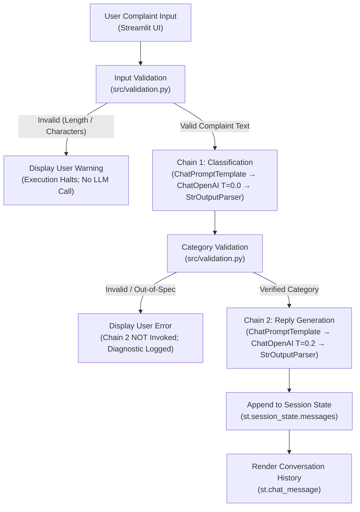

# Complaint Desk

A deterministic two-chain LangChain application for customer complaint classification and controlled acknowledgement generation, built with Streamlit for FWC AI/ML Training Module 8 (Activity A).

---

## Project Status

**CURRENT:**
- The architecture is fully built and **tested offline** (via `FakeListChatModel`).
- The application is **configured for `gpt-4o-mini`**.
- **No live GPT inference** is currently performed.
- Zero code changes are required when an API key becomes available (managed entirely via `.env`).

**FUTURE:**
- Genuine `gpt-4o-mini` evaluation and benchmark scoring will occur once API credentials are provided.
- The frozen 10-complaint benchmark will be empirically tested against actual live model responses.

---
## Overview

**Complaint Desk** is an automated customer intake application that accepts customer complaints, classifies them into one of four supported categories (`billing`, `loan`, `fraud`, or `app_issue`), and generates an empathetic, professional customer intake acknowledgement.

The project demonstrates production-grade LLM engineering principles:
- **Defensive input sanitization**: Validates length, character encoding, and structure before invoking models.
- **Two-chain sequential workflow**: Decouples classification from reply generation using LangChain Expression Language (LCEL).
- **Strict category whitelisting**: Normalizes and checks classifier output against a closed taxonomy; invalid outputs halt the pipeline immediately without calling the reply model.
- **Controlled generation**: Uses low-temperature decoding and strict negative prompt guardrails to prevent fabricated company policies, false financial promises, or false claims of internal routing.
- **Session state persistence**: Maintains conversation history locally across Streamlit reruns.

> **Architectural Note:** Complaint Desk is **not** an AI agent. It does not use agentic loops, tools, autonomous reasoning, LangGraph, vector databases, or retrieval-augmented generation (RAG). It implements two deterministic LangChain pipelines orchestrated via standard Python control flow as specified in Module 8.

---

## Key Features

- **Strict Four-Category Classification**: Automatically maps complaints into `billing`, `loan`, `fraud`, or `app_issue`.
- **Decoupled Two-Chain LCEL Architecture**:
  - Chain 1: Intake classification (`ChatPromptTemplate → ChatOpenAI → StrOutputParser`).
  - Chain 2: Customer acknowledgement (`ChatPromptTemplate → ChatOpenAI → StrOutputParser`).
- **Input Validation Layer**: Rejects empty strings, whitespace, non-printable control characters, and inputs outside 5–4000 characters while preserving currency symbols ($, ₹, €, £) and multilingual UTF-8 text.
- **Category Normalization & Whitelisting**: Sanitizes markdown artifacts and prefixes while preserving category tokens (`app_issue`), strictly rejecting out-of-spec categories.
- **Safe Pipeline Halting**: Completely suppresses Chain 2 invocation if classification fails or produces an unverified category.
- **Guardrailed Support Acknowledgement**: Limits responses to 2–4 sentences, acknowledges the verified category, and forbids inventing policies, refund timelines, or claims that human personnel have reviewed the complaint.
- **Differentiated Temperature Strategy**: Configures $T=0.0$ for classification (minimizing token variance) and $T=0.2$ for reply generation (allowing natural phrasing while minimizing hallucination risk).
- **Session-State Conversation Persistence**: Uses Streamlit's `st.session_state` to maintain chat history and provide a conversation reset button.
- **Provider-Decoupled Design**: Abstracted via `BaseChatModel` factory functions to prepare for future local model swapping (e.g., Ollama/Mistral in Activity B) without modifying prompts, chains, or UI logic.
- **Deterministic Offline Test Suite**: 37 automated tests verifying input validation, normalization, and LCEL contracts using `FakeListChatModel` with zero external API calls.
- **Frozen 10-Complaint Benchmark**: Curated evaluation dataset in `evaluation/test_complaints.json` with ground truth labels and evaluation criteria for empirical assessment.

---

## Architecture

The application implements a linear, deterministic pipeline orchestrated through Python control flow:



The application strictly separates responsibilities:
1. `app.py`: UI rendering, session state management, and user error presentation.
2. `src/config.py`: Environment configuration, hyperparameter defaults, and secret masking.
3. `src/prompts.py`: LangChain prompt templates, domain boundaries, and guardrails.
4. `src/chains.py`: LCEL runnable assembly and model provider abstraction.
5. `src/validation.py`: Pure, deterministic input sanitization and category whitelisting.

---

## Application Flow

### Step 1 — Complaint Input
The user inputs customer complaint text via the Streamlit chat input interface (`st.chat_input("Describe the customer's complaint...")`).

### Step 2 — Input Validation
`validate_complaint()` inspects the input:
- Verifies the input is a valid string.
- Rejects unprintable control characters (`\x00-\x08`, etc.).
- Trims surrounding whitespace.
- Enforces the length threshold: minimum 5 characters, maximum 4,000 characters.
- If validation fails, the UI displays an error banner, logs sanitized diagnostics, and halts execution before any LLM is instantiated.

### Step 3 — Classification Chain (Chain 1)
If the input is valid, the complaint is passed to Chain 1:
- Configured with `temperature = 0.0` and `max_tokens = 15`.
- Prompt instructs the model to select exactly one lowercase category token.
- Returns raw string output via `StrOutputParser`.

### Step 4 — Category Validation & Normalization
The raw classifier string passes through `validate_category()`:
- `normalize_category()` strips extraneous formatting: markdown asterisks (`**`), code backticks (`` ` ``), quotes, optional `Category:` prefixes, and trailing punctuation while preserving internal underscores required for `app_issue`.
- Checks exact membership against `ALLOWED_CATEGORIES = ("billing", "loan", "fraud", "app_issue")`.
- **Safe Rejection**: If the output is not an exact match, the pipeline halts immediately. Chain 2 is never called. A user-friendly error message is displayed, and diagnostic details are recorded locally without exposing credentials.

### Step 5 — Reply Generation Chain (Chain 2)
If the category is verified, both the complaint and verified category are passed to Chain 2:
- Configured with `temperature = 0.2` and `max_tokens = 300`.
- Generates a measured 2–4 sentence intake acknowledgement under strict guardrails.

### Step 6 — Conversation Persistence
The interaction dictionary (`{"complaint": ..., "category": ..., "reply": ...}`) is appended to `st.session_state.messages` and rendered in the main chat view.

---

## LangChain Implementation

Both pipelines are constructed using LangChain Expression Language (LCEL) in [`src/chains.py`](file:///D:/Projects/complaint-desk/src/chains.py):

```python
# Chain 1: Classification Pipeline
classification_chain = CLASSIFICATION_PROMPT | classification_llm | StrOutputParser()

# Chain 2: Customer Reply Generation Pipeline
reply_chain = REPLY_PROMPT | reply_llm | StrOutputParser()
```

### Model Decoupling (Activity B Preparation)
Chains consume LangChain's `BaseChatModel` interface rather than directly binding to `ChatOpenAI`. The provider instantiation is centralized in `get_chat_model()`:

```python
def get_chat_model(
    api_key: Optional[str] = None,
    model_name: str = "gpt-4o-mini",
    temperature: float = 0.0,
    max_tokens: Optional[int] = None,
) -> BaseChatModel:
    return ChatOpenAI(
        api_key=api_key or None,
        model=model_name,
        temperature=temperature,
        max_tokens=max_tokens,
        timeout=30.0,
        max_retries=2,
    )
```

In Activity B, switching to a local Ollama model (`ChatOllama(model="mistral", temperature=0.3)`) requires modifying only the model factory configuration without altering prompt templates, chain structure, or UI orchestration.

---

## Prompt Design

Prompt templates are located in [`src/prompts.py`](file:///D:/Projects/complaint-desk/src/prompts.py).

### 1. Classification Prompt
- **Role**: Automated intake categorization engine.
- **Explicit Domain Boundaries**: Clearly defines the scope for all four categories.
- **Disambiguation Rule**: Explicitly addresses boundary overlap between billing and fraud:
  > *"If the customer explicitly states that they did not authorize the transaction or account activity, classify as fraud. If the customer recognizes the transaction or payment context but disputes the amount, fee, duplication, invoice, or processing, classify as billing."*
- **Few-Shot Examples**: Concrete examples demonstrating the exact output format for `billing`, `fraud`, and `app_issue`.
- **Negative Constraints**: Strictly forbids markdown, punctuation, quotes, commentary, or conversational filler.
- **Token Cap**: Capped at `max_tokens=15` to structurally restrict output length.

### 2. Reply Generation Prompt
- **Role**: Professional customer support intake assistant.
- **Strict Guardrails**:
  1. **Conciseness**: Enforces a strict length of 2 to 4 sentences.
  2. **Relevance**: Directly references the verified category and acknowledges customer distress.
  3. **Tone**: Enforces a calm, respectful, empathetic, and professional customer-support tone.
  4. **No Fabricated Policies**: Prohibits inventing company procedures, policies, or resolution timelines.
  5. **No False Promises**: Prohibits promising refunds, fee waivers, loan approvals, interest recalculations, or specific monetary outcomes.
  6. **Neutral Intake Confirmation**: Explicitly commands the model **not** to claim that a department, human specialist, or review team has received, opened, or routed the complaint. The response serves purely as an automated intake acknowledgement.
- **Token Cap**: Capped at `max_tokens=300` to prevent runaway generation while allowing natural sentence completion.

---

## Temperature Configuration & Engineering Rationale

The application uses differentiated temperature settings configured via environment variables:

```bash
TEMPERATURE_CLASSIFICATION=0.0
TEMPERATURE_REPLY=0.2
```

### Mathematical & Engineering Rationale
The sampling temperature $T$ scales logits $z_i$ prior to softmax normalization:
$$P(w_i) = \frac{\exp(z_i / T)}{\sum_j \exp(z_j / T)}$$

- **Classification ($T = 0.0$)**:
  Classification is a closed-domain discrete categorization task. Setting $T = 0.0$ applies greedy argmax decoding, concentrating probability mass on the model's highest-confidence token. This reduces sampling variability across runs and minimizes the likelihood of the model emitting extraneous conversational tokens or invalid category names. *(Note: While $T=0.0$ sharply reduces sampling variance, it does not mathematically guarantee 100% determinism across distributed GPU clusters or provider infrastructure updates).*
- **Reply Generation ($T = 0.2$)**:
  For customer-facing responses, higher temperatures ($T \ge 0.7$) significantly elevate hallucination risk—such as fabricating refund amounts or promising specific turnaround times. Conversely, a temperature of $0.0$ can produce repetitive, rigid phrasing. Setting $T = 0.2$ provides an appropriate engineering balance: it allows sufficient linguistic naturalness for empathetic phrasing while keeping token generation tightly bound by the prompt guardrails.

---

## Category Definitions

| Category | Description & Scope | Example Scenario |
|---|---|---|
| **`billing`** | Recognized or disputed financial activity, duplicate charges, incorrect amounts, recurring subscriptions, fees, or payment processing discrepancies. | A customer recognizes their monthly subscription charge but was billed twice on the same statement. |
| **`loan`** | Personal or home loan accounts, interest rate calculations, EMI payment schedules, auto-debit dates, loan approvals, or principal balance inquiries. | An EMI deduction is debited two days before the agreed schedule date, causing an overdraft fee. |
| **`fraud`** | Explicitly unauthorized transactions, suspicious account activity, account takeover, phishing messages, unsolicited OTP alerts, or compromised credentials. | A customer receives an unprompted OTP for a wire transfer they never initiated or authorized. |
| **`app_issue`** | Technical software defects, mobile application crashes, biometric login errors (Face ID/fingerprint), frozen screens, or system error codes. | The mobile app crashes back to the home screen every time Face ID authentication is attempted. |

---

## Project Structure

```text
complaint-desk/
├── .env.example              # Environment variable configuration template
├── .gitignore                # Version control exclusions (secrets, venvs, caches)
├── README.md                 # Complete project documentation and architecture
├── requirements.txt          # Exact pinned dependencies tested on Python 3.13.9
├── app.py                    # Streamlit web application and UI orchestration
├── src/
│   ├── __init__.py           # Package marker
│   ├── chains.py             # Decoupled LangChain LCEL pipelines (Classification & Reply)
│   ├── config.py             # Typed configuration container (AppConfig) and constants
│   ├── prompts.py            # Prompt templates with disambiguation rules and guardrails
│   └── validation.py         # Pure deterministic input sanitization and category whitelisting
├── evaluation/
│   └── test_complaints.json  # Frozen 10-complaint evaluation benchmark for Activity A/B
└── tests/
    ├── __init__.py           # Test package marker
    ├── test_chains.py        # Offline LCEL contract and pipeline integration tests
    └── test_validation.py    # 24 deterministic input/category boundary unit tests
```

---

## Configuration

Configuration is managed via [`src/config.py`](file:///D:/Projects/complaint-desk/src/config.py) using `python-dotenv`.

Copy `.env.example` to create a local `.env` file:

```bash
cp .env.example .env
```

### Supported Providers

The application orchestrates models via `ChatOpenAI` and supports two configuration pathways:

**OpenAI:**
- Uses the proprietary `gpt-4o-mini` model.
- Requires OpenAI API access (`OPENAI_API_KEY`).

**Groq:**
- Uses `openai/gpt-oss-20b`.
- Requires Groq API access (`GROQ_API_KEY`).
- Accessed seamlessly through Groq's OpenAI-compatible endpoint (`https://api.groq.com/openai/v1`).

> **IMPORTANT**: Groq does not provide the proprietary gpt-4o-mini model. The Groq configuration uses OpenAI's open-weight GPT-OSS 20B model served through Groq. The two models are not identical. The same LangChain chains and prompts operate deterministically with either provider.

### Supported Parameters

| Variable | Default | Description |
|---|---|---|
| `LLM_PROVIDER` | `openai` | Determines the active backend (`openai` or `groq`). |
| `GROQ_API_KEY` | *(None)* | Groq API secret key. |
| `GROQ_MODEL_NAME` | `openai/gpt-oss-20b` | Target Groq model identifier. |
| `OPENAI_API_KEY` | *(None)* | OpenAI API secret key. |
| `OPENAI_MODEL_NAME` | `gpt-4o-mini` | Target OpenAI chat model identifier. |
| `TEMPERATURE_CLASSIFICATION` | `0.0` | Sampling temperature for the classification chain. |
| `TEMPERATURE_REPLY` | `0.2` | Sampling temperature for the reply generation chain. |

> **Activity A Disclosure:** The project originally uses OpenAI / gpt-4o-mini for Activity A. The current live configuration may use Groq / openai/gpt-oss-20b. This distinction is explicit to prevent claiming that benchmark results obtained from GPT-OSS were produced by GPT-4o-mini.

> **Security Assurance**: The `AppConfig` class implements a custom `__repr__` method that automatically masks API keys (`sk-...1234` or `<NOT CONFIGURED>`), preventing accidental exposure in console outputs or application logs.

---

## Installation

### Prerequisites
- **Python Runtime**: Tested and verified under **Python 3.13.9** (64-bit).
- **Git**: For version control.

### Setup Instructions

1. **Clone the repository**:
   ```bash
   git clone https://github.com/Udbhav748/complaint-desk.git
   cd complaint-desk
   ```

2. **Create and activate a virtual environment**:
   ```bash
   # Windows (PowerShell)
   python -m venv venv
   .\venv\Scripts\Activate.ps1

   # Linux / macOS
   python3 -m venv venv
   source venv/bin/activate
   ```

3. **Install exact pinned dependencies**:
   ```bash
   pip install -r requirements.txt
   ```

4. **Configure environment variables**:
   Create a `.env` file in the project root:
   ```bash
   OPENAI_API_KEY=your_actual_api_key_here
   OPENAI_MODEL_NAME=gpt-4o-mini
   TEMPERATURE_CLASSIFICATION=0.0
   TEMPERATURE_REPLY=0.2
   ```

---

## Running Locally

To launch the Streamlit application:

```bash
streamlit run app.py
```

The web interface will open in your default browser at `http://localhost:8501`.

### Interface Elements
- **Main View**: Application header, persistent complaint conversation view, and chat input box (`Describe the customer's complaint...`).
- **Sidebar**:
  - Configured model identifier (`gpt-4o-mini`).
  - Classification and reply temperature values (`0.0`, `0.2`).
  - Real-time API key status indicator (`● API Configured` or `● Configuration Required`).
  - Supported category guide.
  - **"Clear session"** button to reset conversation history.

---

## Testing

The test suite runs completely offline using `pytest` and LangChain's `FakeListChatModel`. Zero external API calls are made during test execution, ensuring reproducible and deterministic evaluation.

### Running the Test Suite
```bash
pytest -v
```

### Verified Test Results
```text
collected 37 items

tests/test_chains.py::test_01_classification_chain_construction PASSED        [  2%]
tests/test_chains.py::test_02_reply_chain_construction PASSED                 [  5%]
tests/test_chains.py::test_03_lcel_composition_steps PASSED                   [  8%]
tests/test_chains.py::test_04_classification_input_contract PASSED            [ 10%]
tests/test_chains.py::test_05_reply_input_contract PASSED                     [ 13%]
tests/test_chains.py::test_06_classification_output_validates_cleanly PASSED  [ 16%]
tests/test_chains.py::test_07_invalid_classifier_output_blocks_reply_invocation PASSED [ 18%]
tests/test_validation.py::test_01_valid_complaint PASSED                      [ 21%]
tests/test_validation.py::test_02_surrounding_whitespace_trimmed PASSED       [ 24%]
tests/test_validation.py::test_03_empty_string_rejected PASSED                [ 27%]
tests/test_validation.py::test_04_whitespace_only_rejected PASSED             [ 29%]
tests/test_validation.py::test_05_non_string_input_rejected PASSED            [ 32%]
tests/test_validation.py::test_06_input_too_short_rejected PASSED             [ 35%]
tests/test_validation.py::test_07_input_too_long_rejected PASSED              [ 37%]
tests/test_validation.py::test_08_normal_punctuation_preserved PASSED         [ 40%]
tests/test_validation.py::test_09_currency_symbols_preserved PASSED           [ 43%]
tests/test_validation.py::test_10_multilingual_text_preserved PASSED          [ 45%]
tests/test_validation.py::test_11_forbidden_control_characters_rejected PASSED [ 48%]
tests/test_validation.py::test_12_billing_accepted PASSED                     [ 51%]
tests/test_validation.py::test_13_loan_accepted PASSED                        [ 54%]
tests/test_validation.py::test_14_fraud_accepted PASSED                       [ 56%]
tests/test_validation.py::test_15_app_issue_accepted PASSED                   [ 59%]
tests/test_validation.py::test_16_case_normalization PASSED                   [ 62%]
tests/test_validation.py::test_17_surrounding_whitespace PASSED               [ 64%]
tests/test_validation.py::test_18_category_prefix_parsing[Category: billing-billing] PASSED [ 67%]
tests/test_validation.py::test_18_category_prefix_parsing[Classification: loan-loan] PASSED [ 70%]
tests/test_validation.py::test_18_category_prefix_parsing[Output: fraud-fraud] PASSED [ 72%]
tests/test_validation.py::test_18_category_prefix_parsing[category: app_issue.-app_issue] PASSED [ 75%]
tests/test_validation.py::test_19_markdown_formatting_removed[**billing**-billing] PASSED [ 78%]
tests/test_validation.py::test_19_markdown_formatting_removed[`loan`-loan] PASSED [ 81%]
tests/test_validation.py::test_19_markdown_formatting_removed[*fraud*-fraud] PASSED [ 83%]
tests/test_validation.py::test_19_markdown_formatting_removed[***app_issue***-app_issue] PASSED [ 86%]
tests/test_validation.py::test_20_app_issue_underscore_preserved PASSED       [ 89%]
tests/test_validation.py::test_21_appissue_rejected PASSED                    [ 91%]
tests/test_validation.py::test_22_billing_issue_rejected PASSED               [ 94%]
tests/test_validation.py::test_23_unknown_category_rejected PASSED            [ 97%]
tests/test_validation.py::test_24_non_string_classification_rejected PASSED  [100%]

============================= 37 passed in 4.12s =============================
```

### Test Scope Summary
- **Input Validation (11 tests)**: Tests string length limits (5–4000), whitespace trimming, empty inputs, non-string types, punctuation preservation, currency preservation (₹, $, €, £), multilingual text, and control character rejections.
- **Category Validation (19 tests)**: Tests whitelisting for each category, case insensitivity, surrounding whitespace, `Category:` prefix stripping, markdown cleanup, `app_issue` underscore preservation, and strict rejection of out-of-spec categories (`appissue`, `billing_issue`, `uncategorized`).
- **Chain Contracts (7 tests)**: Tests LCEL pipeline construction, runnable composition (`ChatPromptTemplate → model → StrOutputParser`), parameter dictionary input contracts, and the orchestration contract confirming invalid categories block downstream reply generation.

---

## Frozen Evaluation Benchmark

To support rigorous empirical evaluation across models (Activity A vs. Activity B), a frozen dataset of 10 representative complaints is maintained in [`evaluation/test_complaints.json`](file:///D:/Projects/complaint-desk/evaluation/test_complaints.json).

### Benchmark Cases Overview

| ID | Topic / Scenario | Expected Category | Key Ground Truth Rationale |
|---|---|---|---|
| **CMP-001** | Duplicate subscription deduction on monthly statement | `billing` | Recognized financial transaction with undisputed merchant identity. |
| **CMP-002** | Personal loan EMI debited two days early | `loan` | Concerns loan repayment scheduling and auto-debit timing. |
| **CMP-003** | Unprompted SMS with OTP for unauthorized wire transfer | `fraud` | Explicit report of unauthorized transaction attempt and security compromise. |
| **CMP-004** | App crash during iOS Face ID biometric authentication | `app_issue` | Software defect and mobile application crash. |
| **CMP-005** | Billed recurring fee following confirmed cancellation | `billing` | Disputed recurring charge on recognized customer account. |
| **CMP-006** | Mortgage refinancing application stalled for 7 weeks | `loan` | Application processing delay and evaluation status inquiry. |
| **CMP-007** | Online banking password and recovery email altered at 3 AM | `fraud` | Severe account takeover and credential compromise without customer authorization. |
| **CMP-008** | Statement history tab crashes with HTTP/2 protocol error | `app_issue` | User interface loading failure and client error code. |
| **CMP-009** | App froze during bill payment, balance debited but bill unpaid | `app_issue` | Compound case: root trigger is technical app crash during payment execution. |
| **CMP-010** | Late fee applied due to bank holiday clearing latency | `billing` | Dispute over fee assessment resulting from processing schedule lag. |

### Evaluation Methodology
Each benchmark entry includes an empty evaluation schema:
```json
"results": {
  "classification_correct": null,
  "reply_relevant": null,
  "invented_policy": null,
  "professional_tone": null,
  "notable_failure": null
}
```
In accordance with academic integrity guidelines, these fields remain `null` until actual model inference is performed and manually evaluated against the defined criteria. The same frozen benchmark will be evaluated identically in Activity B.

---

## Deployment Preparation

The project is structured for clean deployment to **Streamlit Community Cloud** or any containerized hosting service.

### Deployment Checklist
1. **Repository Setup**: Ensure the repository is pushed to a public GitHub repository.
2. **Platform Link**: Connect the GitHub repository to Streamlit Community Cloud (`https://share.streamlit.io`).
3. **Entrypoint Configuration**: Specify `app.py` as the primary application file.
4. **Environment Secrets**: In the Streamlit deployment settings under **Advanced settings &rarr; Secrets**, add the secret configuration:
   ```toml
   OPENAI_API_KEY = "sk-..."
   OPENAI_MODEL_NAME = "gpt-4o-mini"
   TEMPERATURE_CLASSIFICATION = "0.0"
   TEMPERATURE_REPLY = "0.2"
   ```
5. **Cold Start Verification**: Confirm the deployed app loads without errors, presents the empty-state interface, and handles missing keys gracefully.

> **Deployment Status**: Current status: deployment preparation complete; live deployment has not yet been performed. If the application is deployed before an API key is available, it may be used only to verify page availability, UI rendering, configuration state, and missing-key handling. It must not be considered a functional live AI demo. Live GPT-4o-mini inference requires an OpenAI API key.

---

## Activity A Alignment Matrix

| FWC Rubric Dimension | Activity A Requirement | Implementation Evidence |
|---|---|---|
| **Functionality (40%)** | User pastes customer complaint | Streamlit `st.chat_input` interface in `app.py` |
| | Classify into 4 categories | Chain 1 in `src/chains.py` (`billing`, `loan`, `fraud`, `app_issue`) |
| | Generate category-appropriate reply | Chain 2 in `src/chains.py` conditioned on verified category |
| | Conversation persistence | Stored across reruns via `st.session_state.messages` |
| | Safe error handling | `src/validation.py` sanitizes input and safely halts invalid categories |
| **Prompt Quality & Temp (20%)** | Strong prompts with clear roles | System prompts in `src/prompts.py` with disambiguation rules |
| | Strict category formatting | Few-shot examples and strict negative constraints in Chain 1 |
| | Guardrailed acknowledgements | 2–4 sentence limit, anti-routing rule, no false promises in Chain 2 |
| | Documented temperature choice | $T=0.0$ for classification, $T=0.2$ for reply; justified mathematically |
| **GitHub & README (20%)** | Clean repository & structure | Decoupled architecture (`app.py`, `src/`, `tests/`, `evaluation/`) |
| | No leaked secrets | Masked in `AppConfig.__repr__`, `.gitignore` strictly protects `.env` |
| | Pinned dependencies | `requirements.txt` with exact tested versions under Python 3.13.9 |
| | Reproducible documentation | Comprehensive setup, architecture diagrams, and test guides |
| **Live Deployment (20%)** | Deployment readiness | Configured for zero-code-change deployment on Streamlit Cloud |

---

## Limitations & Future Improvements

### Current Limitations
- **Intake Only**: The application acts strictly as an intake acknowledgement system; it does not connect to ticketing systems (e.g., Jira, Zendesk) or backend core banking databases.
- **In-Memory Session Persistence**: Conversation history is stored in Streamlit `session_state`, which resets upon browser refresh or session termination.
- **Closed Taxonomy**: Complaints that fall completely outside the four financial domains are rejected by design rather than directed to a human fallback queue.

### Planned Future Improvements
- **Activity B Extension**: Swap the LLM provider from `ChatOpenAI` to a local `ChatOllama` instance running Mistral 7B, evaluating both models against the identical frozen benchmark.
- **Empirical Scoring**: Complete manual and automated scoring of the 10-complaint benchmark across both model backends.
- **Database Persistence**: Optional external database backing (e.g., PostgreSQL / SQLite) for persistent multi-session ticket management.

---

## License

This project was developed for educational and training purposes as part of the FWC AI/ML Training Program (Module 8). All rights reserved.
