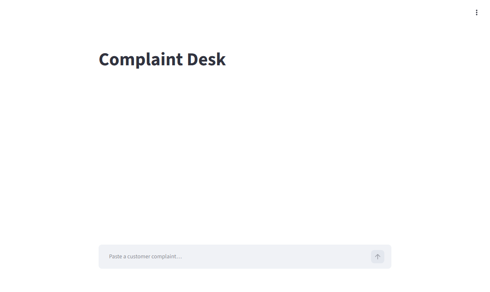
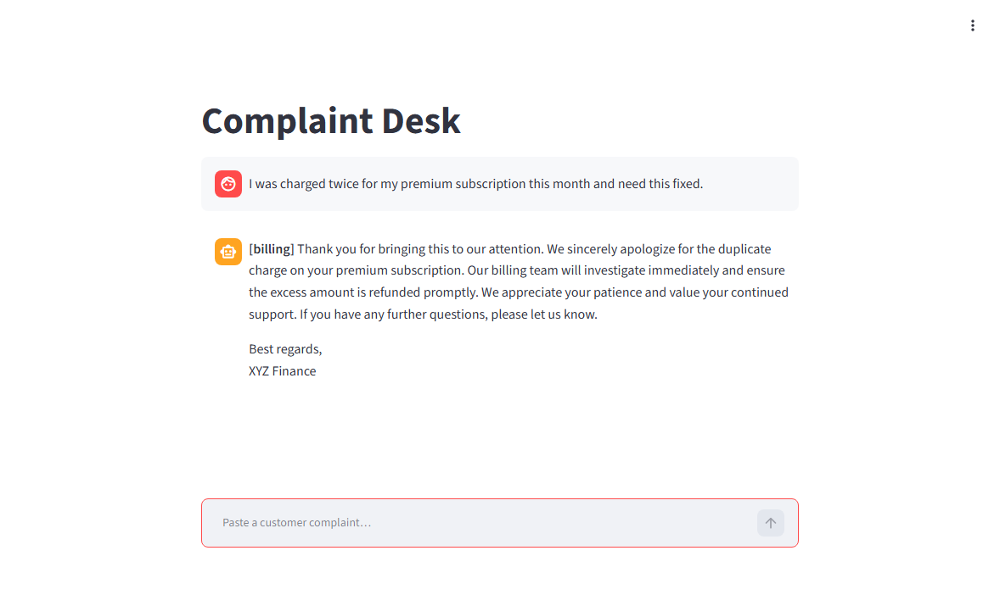

<div align="center">

# 📋 Complaint Desk

**FWC Module 8 — Activity A & Activity B**

[](http://65.1.106.51:8501)
[](https://www.python.org/)
[](https://python.langchain.com/)
[](https://streamlit.io/)
[](Dockerfile)
[](tests/)

**[🚀 Live app](http://65.1.106.51:8501)** · **[📊 Activity B report](activity_b/report.md)**

</div>

<br>

<table>
<tr>
<td width="50%"></td>
<td width="50%"></td>
</tr>
</table>

---

## Important provider note

> The assignment reference uses `ChatOpenAI(model="gpt-4o-mini")`. **No OpenAI API key/credits were
> available for this project.** Both activities below instead use **Groq's OpenAI-compatible API**
> (`openai/gpt-oss-20b`, same `ChatOpenAI` class, different `base_url`) as the practical cloud
> provider. Nowhere in this repository are OpenAI numbers reported — a real OpenAI attempt failed on
> every call with "no credits remaining" (`activity_b/results/openai_attempt_failed.json`), and that
> failure is preserved as evidence rather than papered over.

## Activity A

The exact FWC §18.1 reference implementation:

```text
Complaint → Classification Chain → Reply Chain → Conversation History
```

Two LangChain LCEL chains sharing one `llm` instance, a bare Streamlit UI, no validation, no
guardrails, no RAG/agents/LangGraph. The complete implementation is one file:

**[`activity_a/app.py`](activity_a/app.py)** — see [`activity_a/README.md`](activity_a/README.md).

**Live demo:** http://65.1.106.51:8501

## Activity B

Groq (`openai/gpt-oss-20b`) vs. local Ollama/Mistral, same 10 complaints, same prompts, same
`temperature=0.3` — only the provider changes. Compares:

- Reply quality (relevance, professionalism, unsupported/hallucinated claims)
- Classification accuracy
- Latency
- Cost per 1,000 complaints
- Data privacy
- Final recommendation for a bank deployment

**[`activity_b/`](activity_b/)** — see [`activity_b/report.md`](activity_b/report.md) and the
root-cause follow-up in [`activity_b/followup.md`](activity_b/followup.md).

---

## Project Structure

```text
complaint-desk/
├── activity_a/
│   ├── app.py              # COMPLETE Activity A implementation
│   └── README.md
├── activity_b/
│   ├── run_comparison.py           # Groq vs Ollama, bare reference prompt
│   ├── run_comparison_hardened.py  # Follow-up: hardened prompt on Mistral
│   ├── run_comparison_tuned.py     # Follow-up: targeted fix for Mistral's gap
│   ├── prompts_hardened.py         # Preserved pre-revert hardened prompt
│   ├── prompts_mistral_tuned.py    # The targeted Mistral prompt fix
│   ├── validation.py               # Input/category validation (unit-tested)
│   ├── test_complaints.json        # Frozen 10-complaint benchmark
│   ├── report.md                   # Main Groq vs Ollama comparison
│   ├── followup.md                 # Root-cause analysis of Mistral's gap
│   ├── results/                    # Raw JSON + the Groq/Activity-A reference run
│   └── tools/                      # One-off report-generation scripts (historical)
├── tests/
├── requirements.txt
├── Dockerfile
├── README.md
├── .env.example
└── .gitignore
```

## Setup

```bash
cp .env.example .env     # fill in GROQ_API_KEY
pip install -r requirements.txt
```

## Activity A — Run

```bash
cd activity_a
streamlit run app.py
```

## Activity B — Run

```bash
cd activity_b
python run_comparison.py groq      # cloud: Groq openai/gpt-oss-20b
python run_comparison.py ollama    # local: Ollama mistral (requires `ollama pull mistral`)
```

Results are written to `activity_b/results/<provider>.json`.

## Tests

```bash
pytest -v
```

## Deployment

`Dockerfile` builds and serves `activity_a/app.py` only — Activity B is an offline benchmarking
exercise, not part of the deployed app:

```bash
docker build -t complaint-desk .
docker run -p 8501:8501 --env-file .env complaint-desk
```

Deployed on AWS EC2 via Docker: http://65.1.106.51:8501
