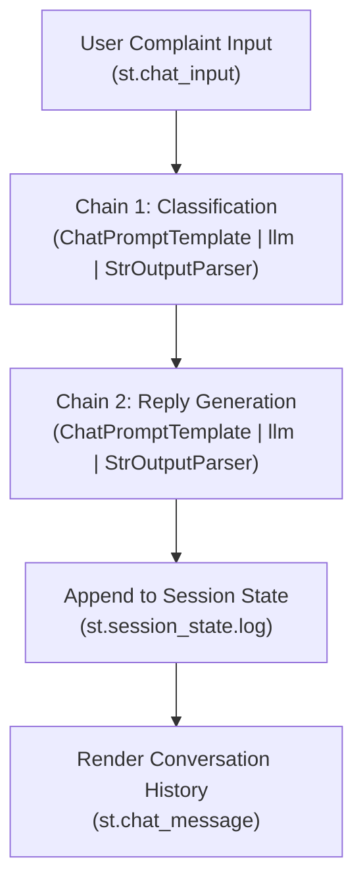
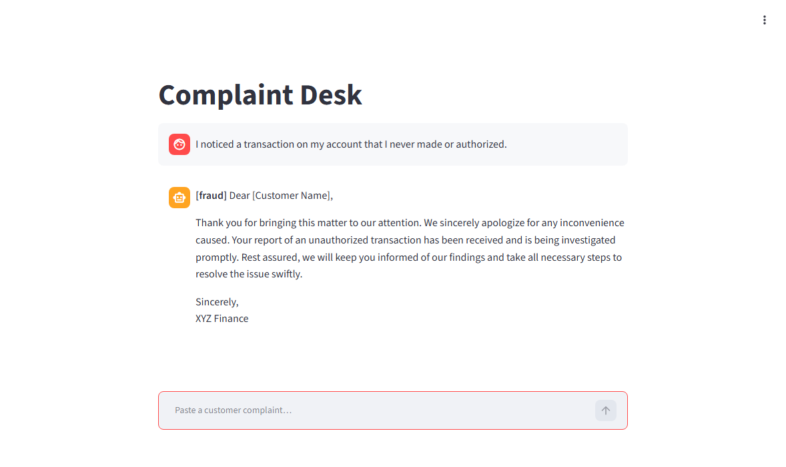
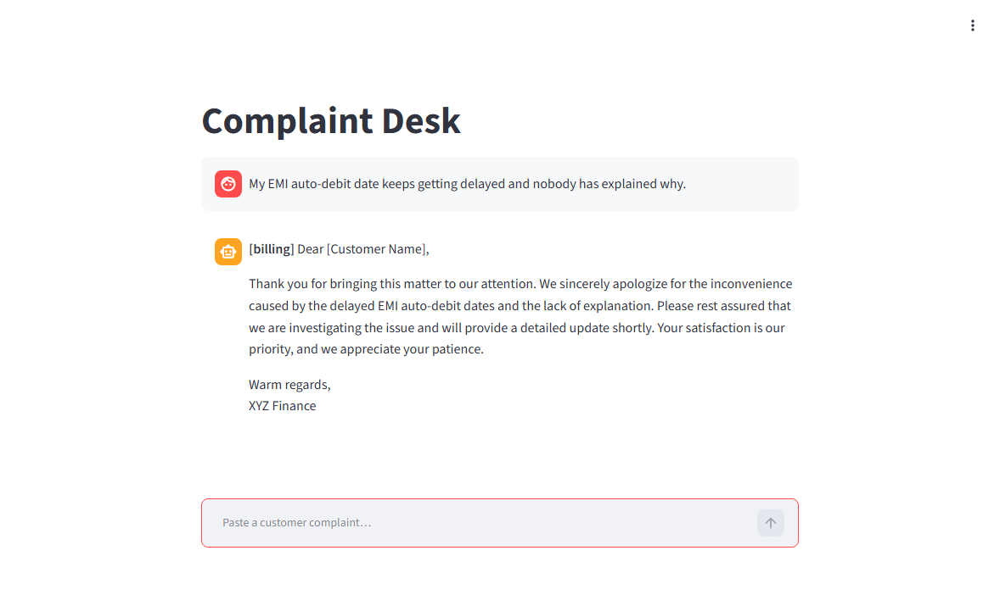
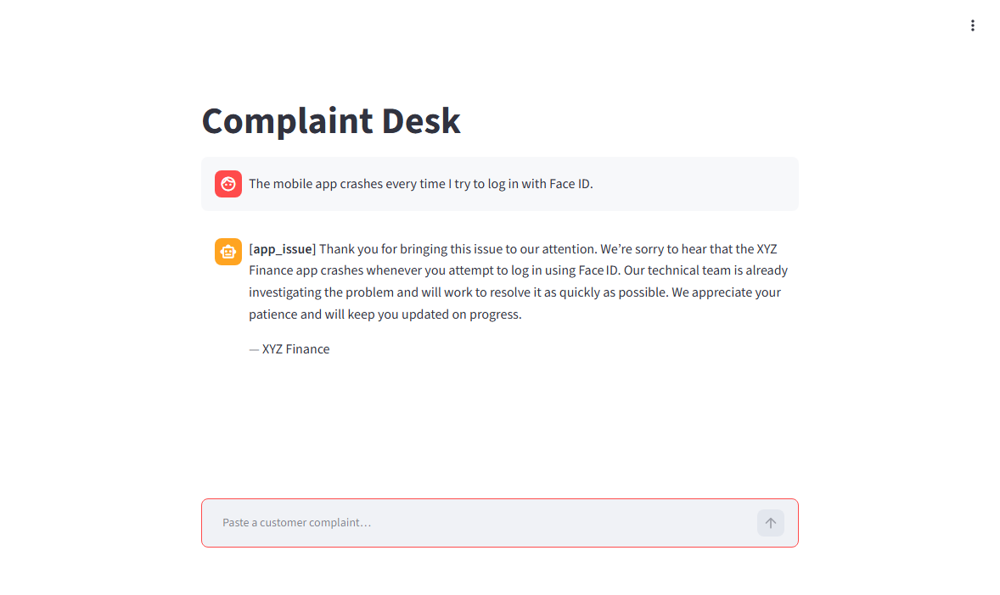

<div align="center">

# 📋 Complaint Desk

**The literal FWC Module 8 §18.1 Activity A reference app — two LangChain LCEL chains, Streamlit UI, deployed.**

Built with Streamlit for FWC AI/ML Training Module 8 — Activity A & Activity B.

[](http://65.1.106.51:8501)
[](https://www.python.org/)
[](https://python.langchain.com/)
[](https://streamlit.io/)
[](Dockerfile)
[](tests/)

**[🚀 Try the live app](http://65.1.106.51:8501)** · **[📊 Activity B comparison](evaluation/activity_b_report.md)** · **[🏗️ Architecture](#architecture)**

</div>

<br>

<table>
<tr>
<td width="50%"></td>
<td width="50%"></td>
</tr>
</table>

<p align="center"><sub>Empty state (left) and a live billing complaint being classified and acknowledged (right). More screenshots in the <a href="#live-deployment-screenshots">deployment gallery</a> below.</sub></p>

---

## Project Status

| | Status | Detail |
|---|---|---|
| ✅ | **Matches the §18.1 reference code exactly** | One shared `llm`, flat `temperature=0.3`, bare 2-line prompts, no validation layer, minimal `st.chat_message` UI — see [Exact-Spec Fidelity](#exact-spec-fidelity) |
| ✅ | **Activity A empirically evaluated** | Frozen 10-complaint benchmark on **Groq / openai/gpt-oss-20b** |
| ✅ | **Provider-agnostic** | Swap providers via `.env` — zero code changes |
| ✅ | **Deployed and live** | AWS EC2 via Docker — [**http://65.1.106.51:8501**](http://65.1.106.51:8501) |
| ✅ | **Activity B complete** | OpenAI ↔ Ollama/Mistral swap benchmarked — [full report](evaluation/activity_b_report.md) |

---

## Exact-Spec Fidelity

This repository's history includes a substantially hardened version of this app (few-shot prompts,
input validation, category whitelisting, custom UI). **That version has been deliberately reverted.**
The current `app.py` and `src/` match the handout's §18.1 reference code line-for-line in architecture:

```python
llm = ChatOpenAI(model="gpt-4o-mini", temperature=0.3)   # one shared model, flat temperature
classify = (ChatPromptTemplate.from_template(
    "Classify into billing/loan/fraud/app_issue. One word only.\n{text}")
    | llm | StrOutputParser())
reply = (ChatPromptTemplate.from_template(
    "Polite 60-word acknowledgement for a {cat} complaint. Sign as XYZ Finance.\n{text}")
    | llm | StrOutputParser())
```

What this means concretely:
- **No input validation.** Empty, malformed, or arbitrarily long input is passed straight to the model.
- **No category whitelist.** Whatever the classifier returns (lowercased/stripped) is used as-is — an
  out-of-spec category string is never caught or blocked.
- **No prompt guardrails.** No few-shot examples, no disambiguation rules, no forbidden-phrase
  constraints. The model is free to promise refunds, claim investigations, or fabricate policy — and
  the empirical results below confirm it does.
- **Minimal UI.** `st.chat_message("user").write(...)` / `st.chat_message("assistant").write(...)`,
  no custom CSS, no sidebar, no error banners.

One deliberate, disclosed deviation remains: **provider**. The handout's snippet uses
`ChatOpenAI(model="gpt-4o-mini")`; this deployment runs on **Groq's `openai/gpt-oss-20b`** instead
(configured via `.env`, zero code changes required to switch back — see [Configuration](#configuration)).
This is the one point not reverted to the literal snippet.

The hardened prompts, validation layer, and provider-specific few-shot fixes are preserved as separate,
documented artifacts used in Activity B's analysis (`src/validation.py` still exists and is unit-tested,
just no longer called by `app.py`; `evaluation/prompts_mistral_tuned.py` documents what it took to fix
a local model's accuracy gap). Nothing was deleted — it was deliberately made unused in the production
app to match the assignment exactly.

---

## Overview

**Complaint Desk** accepts a customer complaint, classifies it into one of four categories (`billing`,
`loan`, `fraud`, `app_issue`), and drafts a short acknowledgement reply signed "XYZ Finance" — a direct
implementation of the FWC Module 8 §18.1 demo app.

> **Architectural Note:** Complaint Desk is **not** an AI agent. It does not use agentic loops, tools,
> autonomous reasoning, LangGraph, vector databases, or retrieval-augmented generation (RAG). It
> implements two deterministic LangChain LCEL pipelines sharing one model instance, orchestrated via
> standard Python control flow.

---

## Architecture


```mermaid
flowchart TD
    A["User Complaint Input<br/>(st.chat_input)"] --> B["Chain 1: Classification<br/>(ChatPromptTemplate | llm | StrOutputParser)"]
    B --> C["Chain 2: Reply Generation<br/>(ChatPromptTemplate | llm | StrOutputParser)"]
    C --> D["Append to Session State<br/>(st.session_state.log)"]
    D --> E["Render Conversation History<br/>(st.chat_message)"]
```

- `app.py`: the entire UI and orchestration — ~25 lines, matching the handout.
- `src/config.py`: environment configuration (`AppConfig`) — provider, model, single `temperature`.
- `src/prompts.py`: the two bare prompt templates, verbatim from the handout.
- `src/chains.py`: builds one shared `llm` and both LCEL chains from it.
- `src/validation.py`: input/category validation utilities — **present in the codebase, unit-tested,
  but not called by `app.py`** (removed from the live flow to match the handout exactly).

---

## LangChain Implementation

```python
# src/chains.py
llm = get_chat_model(api_key=..., model_name=..., temperature=cfg.temperature, provider=cfg.llm_provider)
classification_chain = CLASSIFICATION_PROMPT | llm | StrOutputParser()
reply_chain = REPLY_PROMPT | llm | StrOutputParser()
```

```python
# src/prompts.py — verbatim from the §18.1 handout
CLASSIFICATION_PROMPT = ChatPromptTemplate.from_template(
    "Classify into billing/loan/fraud/app_issue. One word only.\n{text}"
)
REPLY_PROMPT = ChatPromptTemplate.from_template(
    "Polite 60-word acknowledgement for a {cat} complaint. Sign as XYZ Finance.\n{text}"
)
```

For Activity B, the provider line is the only thing that changes: `ChatOpenAI(...)` → `ChatOllama(model="mistral", temperature=0.3)`. See [`evaluation/run_eval_activity_b.py`](evaluation/run_eval_activity_b.py) and [`evaluation/activity_b_report.md`](evaluation/activity_b_report.md).

---

## Temperature

One flat value, shared by both chains, matching the handout exactly:

```bash
TEMPERATURE=0.3
```

No differentiated classification/reply temperatures, no mathematical justification for a split —
there isn't one, because there's only one value. `0.3` is a moderate, general-purpose setting: low
enough for mostly-consistent category labels, high enough to avoid robotic reply phrasing.

---

## Category Definitions

The categories are named directly in the classification prompt (`billing/loan/fraud/app_issue`), with
no further definitions, examples, or disambiguation rules provided to the model:

| Category | Typical scenario |
|---|---|
| `billing` | Duplicate charges, disputed fees, payment-processing discrepancies |
| `loan` | EMI schedules, auto-debit timing, loan/mortgage application status |
| `fraud` | Unauthorized transactions, account takeover, compromised credentials |
| `app_issue` | App crashes, biometric login failures, technical error codes |

---

## Project Structure

```text
complaint-desk/
├── .env.example              # Environment variable configuration template
├── .gitignore                # Version control exclusions (secrets, venvs, caches)
├── README.md                 # Complete project documentation
├── requirements.txt          # Pinned dependencies
├── Dockerfile                # Container build for deployment
├── app.py                    # The entire app — matches the §18.1 handout
├── src/
│   ├── __init__.py
│   ├── chains.py              # One shared llm, two LCEL chains
│   ├── config.py               # AppConfig: provider, model, flat temperature
│   ├── prompts.py              # The two bare prompt templates, verbatim
│   └── validation.py           # Input/category validation (unit-tested, not wired into app.py)
├── evaluation/
│   ├── test_complaints.json    # Frozen 10-complaint benchmark (Activity A & B)
│   ├── run_eval.py             # Activity A benchmark runner
│   ├── run_eval_activity_b.py          # Activity B: literal OpenAI/Ollama swap
│   ├── run_eval_activity_b_hardened.py # Follow-up: hardened prompt on Mistral
│   ├── run_eval_activity_b_tuned.py    # Follow-up: targeted fix for Mistral's gap
│   ├── prompts_hardened_activity_a.py  # Preserved pre-revert hardened prompt (used by the two scripts above)
│   ├── prompts_mistral_tuned.py        # The targeted prompt fix itself
│   ├── activity_a_report.md / .json    # Activity A results
│   └── activity_b_report.md / activity_b_followup.md  # Activity B results
└── tests/
    ├── test_chains.py          # LCEL contract tests (flat-temp, bare-prompt contract)
    ├── test_provider.py        # Provider/config tests
    └── test_validation.py      # Validation utility tests (module not wired into app.py)
```

---

## Configuration

Configuration is managed via [`src/config.py`](src/config.py) using `python-dotenv`. Copy `.env.example` to `.env`:

```bash
cp .env.example .env
```

### Supported Providers

| Variable | Default | Description |
|---|---|---|
| `LLM_PROVIDER` | `openai` | `openai` or `groq` |
| `OPENAI_API_KEY` | *(none)* | OpenAI API secret key |
| `OPENAI_MODEL_NAME` | `gpt-4o-mini` | Matches the handout's model exactly |
| `GROQ_API_KEY` | *(none)* | Groq API secret key |
| `GROQ_MODEL_NAME` | `openai/gpt-oss-20b` | **Currently deployed/tested configuration** |
| `TEMPERATURE` | `0.3` | Shared by both chains, matching the handout |

> **Provider disclosure:** the live deployment runs **Groq `openai/gpt-oss-20b`**, not OpenAI
> `gpt-4o-mini` as shown in the handout's snippet. This is the one deliberate deviation from the
> literal reference code — switching back requires only `.env` changes, no code changes.

---

## Installation

### Prerequisites
- Python 3.13 (64-bit)
- Git

### Setup
```bash
git clone https://github.com/Udbhav748/complaint-desk.git
cd complaint-desk
python -m venv venv
# Windows: .\venv\Scripts\Activate.ps1   |   Linux/macOS: source venv/bin/activate
pip install -r requirements.txt
cp .env.example .env   # then fill in your API key(s)
```

---

## Running Locally

```bash
streamlit run app.py
```

Opens at `http://localhost:8501`. The UI is exactly the handout's: a title, a chat input, and a
running log of `user` / `assistant` message pairs, each assistant reply prefixed with `[category]`.

---

## Testing

```bash
pytest -v
```

41 tests pass, offline, using `FakeListChatModel` — zero external API calls:
- **`test_chains.py`** (7 tests): LCEL composition, the `{text}`/`{cat}` input contract matching the
  handout's variable names, and confirms the reference app's actual behavior — raw classifier output
  is used as-is with no whitelist check.
- **`test_provider.py`** (4 tests): provider/base-URL routing for OpenAI vs. Groq.
- **`test_validation.py`** (24 tests): the validation utilities still work correctly as standalone
  functions — they're just not called by `app.py` anymore.

---

## Frozen Evaluation Benchmark

The same 10-complaint dataset (`evaluation/test_complaints.json`) used for Activity A and Activity B.

### Activity A Empirical Results (current exact-spec code)

Re-run against the live Groq `openai/gpt-oss-20b` deployment after reverting to the literal §18.1 code:

- **Classification Accuracy:** 10/10
- **Average Total Latency:** ~955 ms
- **Replies containing unsupported claims (refunds, investigations, "securing your account"):** **8/10**

> **This number went up, not down**, compared to the earlier hardened-prompt version (which scored
> 5/10 on the same check). That's expected and consistent: the bare reference prompt in §18.1 has no
> guardrails against false promises, so the model readily produces them. Representative example
> (CMP-001, billing): *"Our team is reviewing the transaction and **will issue a refund promptly**."*
> Representative example (CMP-007, fraud): *"We have **initiated a full investigation**... Our fraud
> team will review all relevant logs and **secure** [your account]."* Full raw outputs:
> [`evaluation/activity_a_results.json`](evaluation/activity_a_results.json).

This is not a bug to fix — it's the literal, documented behavior of the assignment's reference prompt,
and it's exactly the finding Activity B's follow-up analysis explores further (see
[`evaluation/activity_b_report.md`](evaluation/activity_b_report.md)): the guardrails that would
prevent this are a deliberate engineering addition on top of the base spec, not part of it.

---

## Deployment

The application is containerized with Docker and deployed to a live AWS EC2 instance.

### Deployment Platform & Evidence
- **Platform**: AWS EC2 (t3.micro, `ap-south-1`), Amazon Linux 2023, Docker container
- **Live URL**: [http://65.1.106.51:8501](http://65.1.106.51:8501)
- **Deployment Status**: Container running with `--restart unless-stopped`; health check
  (`/_stcore/health`) returns `ok`; verified reachable over HTTP from outside the instance.

### Deployment Steps (as executed)
1. **Containerization**: `Dockerfile` builds a `python:3.12-slim` image, installs `requirements.txt`,
   and runs `streamlit run app.py --server.port=8501 --server.address=0.0.0.0`.
2. **Infrastructure**: EC2 instance provisioned via AWS CLI with a dedicated security group (SSH
   restricted to the operator's IP, port `8501` open publicly) and a dedicated key pair.
3. **Bootstrap**: Instance user-data installs and starts Docker on first boot.
4. **Release**: Application source and `.env` copied to the instance via `scp`; image built and run
   on-host with `docker build` / `docker run --env-file .env`.
5. **Verification**: Confirmed container health and public HTTP reachability post-deploy.

> **Note:** This is a demo deployment (plain HTTP, no TLS) for Activity A evaluation, not configured
> for production traffic.

### Live Deployment Screenshots

Captured directly against the live EC2 URL above, running the current exact-spec app.

<table>
<tr>
<td width="33%"><br><sub><b>Empty state</b> — the handout's minimal title + chat input</sub></td>
<td width="33%"><br><sub><b>Billing</b> — note the unguarded refund promise</sub></td>
<td width="33%"><br><sub><b>Fraud</b> — note the unguarded "investigation" claim</sub></td>
</tr>
<tr>
<td width="33%"><br><sub><b>Loan</b> — misclassified as <code>billing</code> by the bare prompt (honest result, not cherry-picked)</sub></td>
<td width="33%"><br><sub><b>App issue</b> — correctly classified and acknowledged</sub></td>
<td width="33%"></td>
</tr>
</table>

---

## Activity A Alignment Matrix

| FWC Rubric Dimension | Requirement | Implementation Evidence |
|---|---|---|
| **Functionality (40%)** | Paste → classify → reply → persist | `app.py`, matching the handout line-for-line |
| **Prompt Quality & Temp (20%)** | Prompt quality, justified temperature | Bare 2-line prompts verbatim from the handout; flat `temperature=0.3` (no split to justify — matches the single value shown) |
| **GitHub & README (20%)** | Clean repo, no leaked secrets, reproducible docs | `.gitignore` protects `.env`/`*.pem`; this README documents the exact deviations (provider) and non-deviations |
| **Live Deployment (20%)** | Live, reachable URL | Deployed via Docker to AWS EC2: [http://65.1.106.51:8501](http://65.1.106.51:8501) |

---

## Activity B — OpenAI ↔ Ollama Swap

Completed. The literal one-line swap (`ChatOpenAI(...)` → `ChatOllama(model="mistral", temperature=0.3)`)
was benchmarked against the same frozen 10-complaint dataset. Full results — reply quality, latency,
cost per 1,000 requests, data privacy, and a 3-sentence shipping verdict — are in
[`evaluation/activity_b_report.md`](evaluation/activity_b_report.md).

Key findings:
- The bare reference prompt produced unsafe false-promise/false-investigation claims on **both**
  providers — this is now also visible directly in Activity A's own results above, not just Activity B's.
- **Follow-up**: hardening the prompt on Mistral dropped guardrail violations to **0/10** across 3 runs,
  but classification stuck at 8/10 with the same 2 cases missed every time. Root-caused to a missing
  disambiguation rule; a targeted fix (`evaluation/prompts_mistral_tuned.py`) brought it to **10/10**,
  confirmed over 2 runs. Full story: [`evaluation/activity_b_followup.md`](evaluation/activity_b_followup.md).
- Latency: cloud ~1s vs. local CPU inference ~20–35s per complaint — the deciding factor once both
  providers reach comparable accuracy.
- The live OpenAI run hit an out-of-credits API error; the cloud comparison point uses Groq's existing
  benchmark data instead, with OpenAI's published pricing used for the cost estimate.

---

## Limitations

- **No input validation in the live app** (by design, to match §18.1 exactly) — arbitrary or malicious
  input is passed directly to the model. `src/validation.py` provides this capability and is
  unit-tested, but intentionally not wired into `app.py`.
- **No category whitelist** — an out-of-spec classifier output is used as-is.
- **No guardrails against false promises** — see the Activity A results above. This is the literal,
  documented behavior of the assignment's reference prompt.
- **In-memory session persistence** — conversation history resets on browser refresh.
- **Intake only** — no connection to ticketing systems or backend banking databases.
